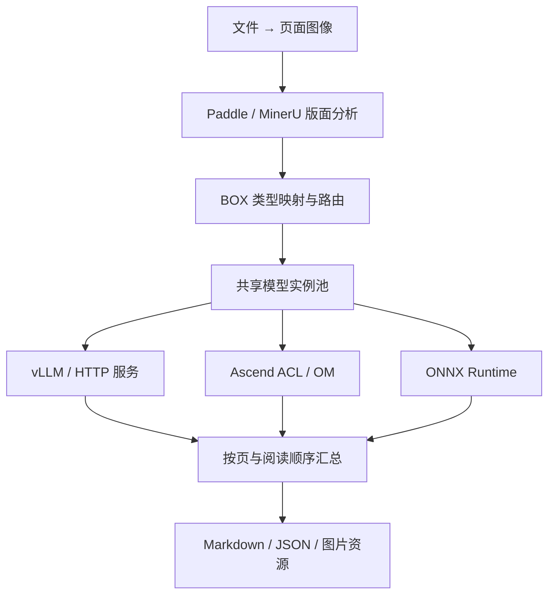

# OmniOCR

**面向昇腾生态的 C++17 文档 OCR 框架：多格式输入、按版面区域选择模型、统一输出 Markdown 与 JSON。**

OmniOCR 将文档转成页面图像，使用 PaddleLayout 或 MinerU2.5-Pro 协议进行版面分析，再把正文、标题、表格、公式等区域（BOX）分配给配置的模型。可以混合使用远程 vLLM/HTTP 服务、本地 Ascend ACL/OM 和 ONNX Runtime，并在不同区域类型之间共享模型实例。

[快速上手](docs/getting-started.md) · [文档目录](docs/README.md) · [配置参考](docs/configuration.md) · [插件与 V3](docs/plugins.md) · [REST API](docs/server.md) · [昇腾部署](docs/ascend.md)

## 可以做什么

- **统一提取文件**：图片、PDF、Office、RTF、OpenDocument、EPUB、OFD、HTML、CSV。
- **按 BOX 配置模型**：不同类型使用不同模型，或共享同一模型池；支持按顺序尝试备选模型。
- **选择运行方式**：单文件 CLI、一次性批处理、可持续提交任务的 REST 服务、C++ API。
- **控制资源与并发**：模型实例池、页面队列、转换并发、页数/像素/超时限制。
- **统一消费结果**：Markdown、结构化 JSON 和可选图片裁剪；保留页序、阅读顺序和错误信息。

## 处理流程



`models` 定义模型池，`layout.model` 选择版面模型，`routes` 按 BOX 类型选择模型或执行保存图片、跳过识别等动作。多个类型引用**同一个模型 ID** 就共享实例池；不同 ID 即使指向同一文件也会分别加载。

本地 OM/ONNX 的 `instances` 是加载的实例数；vLLM/HTTP 的 `instances` 是客户端在途请求槽位，服务端副本需要自行部署。详见 [配置与模型适配](docs/configuration.md)。

## 支持的文件

| 输入 | 后缀 | 运行依赖 |
|---|---|---|
| 扫描/拍摄图片 | `.png .jpg .jpeg .bmp .ppm .pgm .tga` | 内置图像解码 |
| 多页 TIFF | `.tif .tiff` | libtiff |
| PDF / 扫描 PDF | `.pdf` | Poppler |
| Word / PowerPoint / Excel | `.doc .docx .ppt .pptx .xls .xlsx` | LibreOffice + Poppler |
| RTF / OpenDocument | `.rtf .odt .ods .odp` | LibreOffice + Poppler |
| 静态网页 / CSV | `.html .htm .csv` | LibreOffice + Poppler |
| EPUB | `.epub` | Calibre + Poppler |
| OFD | `.ofd` | Java + OFDRW 转换器 + Poppler |

提取基于**渲染后的页面 OCR**：Office 沿用打印分页，CSV 按字面文本渲染，HTML 不执行浏览器 JavaScript。依赖安装、编码、分页和格式限制见 [输入格式说明](docs/input-formats.md)。`--list-formats` 列出支持的后缀，不检查转换器是否已安装。

## 快速跑通

以下为 Ubuntu 源码构建示例；Linux x86_64 / aarch64 均需 C++17 编译器与 CMake ≥ 3.20。默认构建可使用远程模型服务，不依赖 NPU 或 ONNX SDK。

```bash
git clone https://github.com/Tan90degrees/OmniOCR.git
cd OmniOCR
sudo apt-get update
sudo apt-get install -y g++ cmake git libcurl4-openssl-dev libtiff-dev nlohmann-json3-dev
cmake -S . -B build -DCMAKE_BUILD_TYPE=Release
cmake --build build -j4
ctest --test-dir build --output-on-failure
```

准备一张自己的 `example.png`，运行不需要模型的演示：

```bash
./build/omniocr --config configs/demo.json --input example.png --output out/demo --format both
```

输出为 `out/demo/result.md`、`out/demo/result.json` 和按配置生成的 `assets/`。**demo 使用 Mock，输出包含 `[MOCK]`，用于验证流程，不执行真实 OCR。** 输出目录必须不存在或为空；重复运行请换新目录。

要处理 PDF/Office，先按 [输入格式说明](docs/input-formats.md) 安装转换器。完整构建选项、离线依赖、CLI 用法和 REST 演示见 [快速上手](docs/getting-started.md)；x64 / ARM64 原生构建与各自离线包见 [双架构离线包说明](packaging/README.md)。

## 接入真实模型

| 场景 | 从哪个配置开始 | 接入前需要确认 |
|---|---|---|
| MinerU 布局与识别共享服务 | [mineru-vllm.json](configs/mineru-vllm.json) | 服务已启动，endpoint、模型名和特殊 token 配置匹配 |
| Paddle 布局服务 + vLLM 识别 | [paddle-http-vllm.json](configs/paddle-http-vllm.json) | Paddle 桥接服务及识别服务均已配置 |
| ONNX 布局 + ACL 文字识别 + vLLM 表格/公式 | [paddle-local.json](configs/paddle-local.json) | 启用本地后端，核对模型签名、预处理、词表和 BOX 语义 |
| 无模型流程演示 | [demo.json](configs/demo.json) | 仅用于流程与调度验证 |

修改对应配置后，在仓库根目录执行，例如：

```bash
./build/omniocr --config configs/mineru-vllm.json --validate
./build/omniocr --config configs/mineru-vllm.json --input example.png --output out/mineru --format both
```

`--validate` 只检查配置结构与引用，不加载模型、不探测服务。配置模板需要匹配真实部署；OmniOCR 不附带模型权重，也不自动启动 vLLM。

本地后端当前内置 Paddle 已解码检测框与 CTC 文字行解码，其他模型需要适配；CTC 不能直接替代多行段落、表格或公式模型。具体输入输出约定见 [模型适配](docs/configuration.md)，OM 编译与实机记录见 [昇腾部署](docs/ascend.md)。

## 选择运行方式

| 需求 | 入口 | 说明 |
|---|---|---|
| 处理一个文件 | [CLI](docs/getting-started.md#cli-参数与输出) | `--input` / `--output`，按页处理 |
| 一次提交多个文件 | [批处理](docs/batch.md) | `--batch jobs.json`，共享模型池和页级优先级队列 |
| 运行中持续提交文件 | [REST 服务](docs/server.md) | 路径提交或原始二进制上传，异步查询状态与结果 |
| 嵌入 C++ 应用 | [C++ 集成](docs/architecture.md#c-集成) | 复用 Pipeline，或扩展 Model / TensorEngine |

优先级作用于已就绪页面，不抢占正在运行的推理。服务与批处理使用全局页面工作线程，每页 BOX 串行；单文件 CLI 的 BOX 并发由 `execution.workers` 控制。详见 [调度与资源生命周期](docs/architecture.md)。

## 文档导航

| 文档 | 内容 |
|---|---|
| [文档目录](docs/README.md) | 按使用场景选择阅读路径 |
| [快速上手](docs/getting-started.md) | 构建、离线依赖、首个任务、CLI 与 REST 演示 |
| [输入格式](docs/input-formats.md) | 全部文件类型、转换器安装与内容边界 |
| [配置与模型适配](docs/configuration.md) | 模型池、BOX 路由、fallback、后端协议、JSON 结果 |
| [插件与 PP-DocLayoutV3](docs/plugins.md) | v2 配置、轮廓裁剪、C ABI 插件与能力边界 |
| [REST API](docs/server.md) | 启动、上传、路径提交、状态/结果、容量限制 |
| [批处理](docs/batch.md) | 任务清单、优先级、并发参数和退出码 |
| [架构与 C++ 集成](docs/architecture.md) | 模块边界、调度、资源生命周期、扩展接口 |
| [昇腾部署](docs/ascend.md) | vLLM-Ascend、OM 适配、310P3 记录及已知问题 |
| [并发与性能](docs/performance.md) | 已实现优化、可复现压测、资源指标与后续路线 |
| [测试与验证](docs/testing.md) | 测试命令、覆盖范围、实机与准确率验收边界 |
| [x64 / ARM64 离线包](packaging/README.md) | 双架构构建、各自下载/验证及 SDK、转换器依赖 |

当前为 **0.1 基线**。已有自动化功能测试和用户提供的 310P3 真实 OCR 链路验证；全面准确率、性能与长期稳定性仍需目标环境验收。ACL 退出阶段 SIGSEGV 仍由 [Issue #2](https://github.com/Tan90degrees/OmniOCR/issues/2) 跟踪，结果生成不代表正常退出。验证依据与范围统一见 [测试文档](docs/testing.md) 和 [昇腾记录](docs/ascend.md)。
