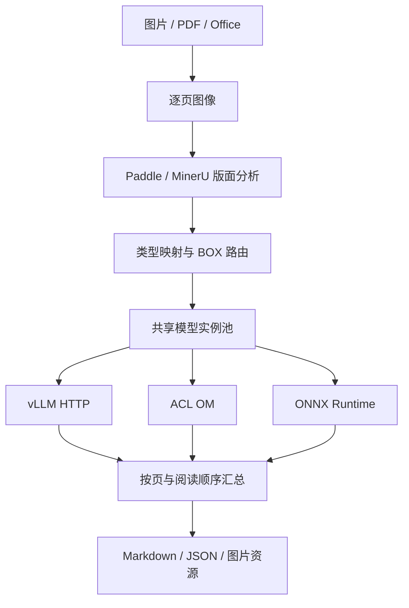

# OmniOCR

面向昇腾生态的 C++17 文档 OCR 框架。统一处理图片、PDF、Word、PPT、Excel，通过可配置版面分析与 BOX 路由，组合远程 vLLM、Ascend ACL/OM 和 ONNX Runtime，输出 Markdown 与 JSON。

当前为可编译、带集成测试的 **0.1 基线**。真实模型的权重、导出签名、前后处理参数和目标 CANN/vLLM 版本需要随部署确定；不会把“有推理接口”当成“任意模型即插即用”。

## 处理流程



每个模型 ID 只创建一个实例池，多个 BOX 类型引用同一 ID 时共用池；布局阶段也可以引用同一 ID。对 OM/ONNX，`instances` 是实际加载的模型实例数；对 vLLM，它是客户端最大在途请求数，服务端模型副本由 vLLM 的部署管理。

## 能力与边界

| 模块 | 当前实现 | 部署条件 / 边界 |
|---|---|---|
| 图片 | PNG、JPEG、BMP、PPM/PGM、TGA；RGB、透明背景合成 | 暂不含 TIFF/WebP、多帧图片 |
| PDF | Poppler 按页渲染、数字页序、页数和像素上限 | 需要 `pdfinfo`、`pdftoppm` |
| Word/PPT/Excel | DOC/DOCX、PPT/PPTX、XLS/XLSX → PDF | LibreOffice；沿用打印分页，不读取 Excel 公式语义或隐藏工作表 |
| PaddleLayout | Paddle JSON 适配器；本地 `[N,6]` 检测输出解码 | 本地导出需匹配模型输入、类别表、坐标约定；V2 的阅读顺序网络不能用单个检测输出替代 |
| MinerU2.5-Pro | vLLM 版面 token、0–1000 坐标、旋转、分块识别 | 示例针对官方 MinerU 版面协议，需匹配实际权重和服务版本 |
| vLLM | OpenAI 兼容多模态 Chat Completions | 完整 endpoint、模型名、按 BOX 配置 prompt；不在客户端启动 vLLM |
| ONNX | 原生 ONNX Runtime C++ Session | 当前使用 CPU EP；输入为 float32，内置 Paddle 检测 / CTC 解码 |
| ACL | OM 加载、独立 context、设备内存、H2D/执行/D2H | 可选编译；初版只支持 host 模式、静态 shape、float32 输入；需昇腾设备验证 |
| 并发 | 固定数量 BOX 工作线程、共享实例池、获取实例超时 | 每次 `run()` 逐页处理，最多保留一页图像及有限个裁剪；文本结果保存在内存 |
| 输出 | Markdown、JSON、图片裁剪、OTSL→HTML 合并表格 | 保留原始表格文本；不做跨页表格/段落合并 |

## 构建

Linux x86_64 / aarch64，GCC 支持 C++17，CMake ≥ 3.20。

```bash
sudo apt-get install -y g++ cmake libcurl4-openssl-dev nlohmann-json3-dev poppler-utils libreoffice
cmake -S . -B build -DCMAKE_BUILD_TYPE=Release
cmake --build build -j4
ctest --test-dir build --output-on-failure
```

默认构建不依赖 NPU 或 ONNX SDK，可直接使用 vLLM/HTTP。JSON 优先使用已安装依赖；图像编解码使用固定提交的 stb。离线构建可指定：

```bash
cmake -S . -B build \
  -DSTB_INCLUDE_DIR=/opt/deps/stb \
  -DNLOHMANN_JSON_INCLUDE_DIR=/opt/deps/json/include
```

启用本地推理：

```bash
cmake -S . -B build-ascend \
  -DOMNIOCR_WITH_ACL=ON -DASCEND_HOME=/usr/local/Ascend/ascend-toolkit/latest \
  -DOMNIOCR_WITH_ONNX=ON -DONNXRUNTIME_ROOT=/opt/onnxruntime
cmake --build build-ascend -j4
```

`ASCEND_HOME` 下需有 `include/acl/acl.h` 和 `lib64/libascendcl.so`；`ONNXRUNTIME_ROOT` 下需有 `include/onnxruntime_cxx_api.h` 和 `lib/libonnxruntime.so`。SDK 必须匹配主机架构，运行时需能找到对应动态库。详见 [昇腾部署](docs/ascend.md)。

## 快速运行

无需模型的流水线演示（结果显式标为 MOCK，不用于评估识别精度）：

```bash
./build/omniocr --config configs/demo.json --input document.pdf --output out/demo
```

真实 MinerU 服务：

```bash
./build/omniocr --config configs/mineru-vllm.json --input document.docx --output out/mineru --format both
```

`--output` 必须是不存在或为空的目录，避免覆盖已有结果。`--format` 支持 `both`（默认）、`json`、`markdown`。输出包含 `result.json`、`result.md`，以及配置了图片保存的 `assets/`。输入/配置路径支持空格和单引号。

```bash
./build/omniocr --config configs/mineru-vllm.json --validate
```

此命令检查配置结构和引用关系，不加载权重、不探测服务。正常完成返回 0；致命错误返回 1；`on_error: record` 下输出部分结果并返回 2。转换/布局失败始终属于致命错误。失败运行可能留下已写出的裁剪文件，重试请使用新的输出目录。

## 多文件优先级与 PDF 按页调度

批处理使用**一个** Pipeline 和共享模型池，不需要对每个文件单独启动 OmniOCR 进程。
例如创建 \`jobs.json\`（输入和输出路径相对于此清单所在目录）：

\`\`\`json
{
  "options": {
    "page_workers": 4,
    "max_active_documents": 2,
    "max_queued_pages": 2
  },
  "jobs": [
    {"input": "in/normal.pdf", "output": "out/normal", "priority": 0},
    {"input": "in/urgent.pdf", "output": "out/urgent", "priority": 100},
    {"input": "in/notes.docx", "output": "out/notes", "priority": 20}
  ]
}
\`\`\`

\`\`\`bash
./build/omniocr --config configs/acl_vllm_ocr.json --batch /path/to/jobs.json --format both
\`\`\`

上面的配置路径仅作示例，应改为实际存在的文件。单文件 \`--input/--output\` 命令保持兼容；\`--batch\` 与这两个参数不可并用。清单可直接写成任务数组，也可使用示例中的 \`jobs/options\` 对象。优先级越大，**已就绪**的页面越先调度；不抢占正在执行的页面。等优先级按入队顺序执行，各文件返回和写出的页序仍按原始页码排列。

\`page_workers\` 默认取 \`execution.workers\`；\`max_active_documents\` 默认 2，\`max_queued_pages\` 默认 2。批处理模式下每页 BOX 串行处理，避免页面和 BOX 双层线程池相乘；NPU/vLLM 模型并发同时受到各自 \`instances\` 池大小约束。PDF/Office 转换子进程与页面推理可并行，总进程 CPU/内存仍需按文档尺寸配置。一个文件失败时，其他文件继续写结果；整个批次若有文件级失败，CLI 返回 1；仅有 \`record\` 模式 BOX 失败返回 2；全部成功返回 0。各任务输出目录必须互不重叠。

此接口处理**一次性提交的批次**，暂不支持任务运行期间动态插入或调整优先级、跨进程持久化队列和页面级强制抢占。详见[调度说明](docs/architecture.md)。

## 配置示例

```json
{
  "version": 1,
  "execution": {"workers": 8, "on_error": "fail"},
  "layout": {"provider": "mineru", "model": "shared_vlm", "image_size": [1036, 1036]},
  "models": {
    "shared_vlm": {
      "backend": "vllm", "instances": 4,
      "endpoint": "http://127.0.0.1:8000/v1/chat/completions",
      "model": "mineru", "acquire_timeout_ms": 240000,
      "parameters": {"max_tokens": 8192, "skip_special_tokens": false}
    },
    "table_vlm": {
      "backend": "vllm", "instances": 2,
      "endpoint": "http://127.0.0.1:8002/v1/chat/completions",
      "model": "table-model"
    }
  },
  "routes": {
    "text": {"model": "shared_vlm", "prompt": "\nText Recognition:"},
    "title": {"model": "shared_vlm", "prompt": "\nText Recognition:"},
    "table": {"model": "table_vlm", "prompt": "Table Recognition:"},
    "image": {"action": "image"},
    "*": {"model": "shared_vlm", "prompt": "\nText Recognition:"}
  }
}
```

这里 `text/title` 与版面分析共用 4 个客户端槽位，表格使用独立池。不同模型 ID 即使指向相同文件也会分别加载。要共享必须引用同一个 ID。

完整示例：

- [demo.json](configs/demo.json)：不依赖模型的演示。
- [mineru-vllm.json](configs/mineru-vllm.json)：MinerU 布局与识别共享服务。
- [paddle-http-vllm.json](configs/paddle-http-vllm.json)：Paddle 布局服务 + vLLM 识别。
- [paddle-local.json](configs/paddle-local.json)：ONNX 布局 + ACL CTC + vLLM 表格/公式，属于需按实际导出修改的配置模板。

Paddle 布局服务的可选桥接程序：

```bash
# 先安装适合当前设备的 PaddlePaddle，再安装 paddleocr、Pillow、numpy
python tools/paddle_layout_server.py --model PP-DocLayoutV2 --device cpu --port 8001
./build/omniocr --config configs/paddle-http-vllm.json --input scan.png --output out/paddle
```

桥接程序只承载 Paddle 模型，主流水线、调度、裁剪、本地推理与输出均为 C++。桥接服务默认监听 localhost，串行承载一个模型实例；真实 Paddle 权重未在当前开发环境下载验证。

## C++ 集成

```cpp
#include <omniocr/core.hpp>

auto config = omniocr::load_config("configs/mineru-vllm.json");
omniocr::Pipeline pipeline(config); // 加载模型一次，可顺序复用处理多个文档
auto document = pipeline.run("document.pdf", "out/document");
omniocr::write_outputs(document, "out/document", "both");
```

可通过 `ModelFactory` 注入自定义 `Model`，或实现 `TensorEngine` 并配套模型预处理/解码器。布局与识别共用模型注册表；不要在 BOX 回调中重新创建模型。外层如需并发调用 `run()`，应自行限制文档并发，因为工作线程上限是每次调用的上限。

## 验证

```bash
ctest --test-dir build --output-on-failure
python3 -m pip install python-docx python-pptx openpyxl reportlab onnx
python3 tests/document_integration.py build/omniocr
python3 tests/onnx_integration.py build-ascend/omniocr
```

已验证：Linux C++ 编译；实例并发上限、异常归还、租用超时；Paddle/MinerU 模拟 HTTP 的真实 C++ 请求与裁剪；OTSL 合并单元格；DOC/DOCX/PPT/PPTX/XLS/XLSX 实际 LibreOffice 转换；12 页 PDF 数字顺序；真实 ONNX Runtime 执行生成的小模型与 shape 校验。

尚未验证：Ascend ACL 编译与 NPU 实机执行、真实 Paddle/MinerU 权重的识别精度、特定 CANN/vLLM 组合的兼容性。此仓库不附带模型权重，也不声明已经完成这些验证。

更多说明：[架构](docs/architecture.md) · [配置与模型适配](docs/configuration.md) · [昇腾部署](docs/ascend.md)。
